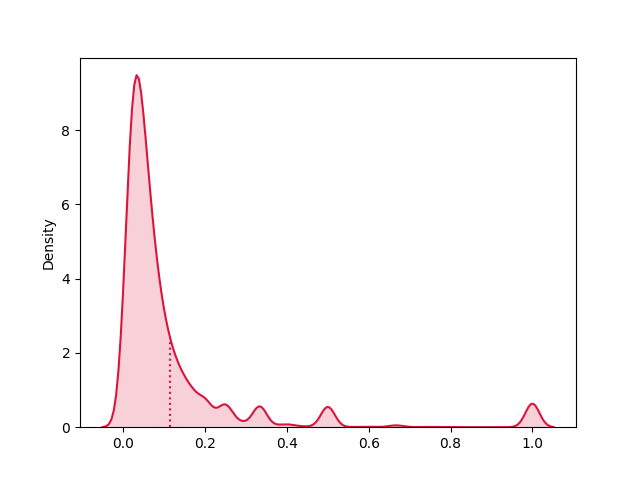
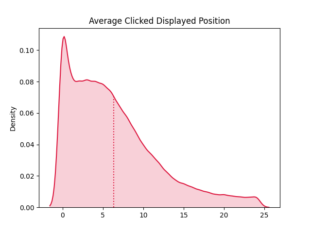

# CTR And Session Analysis

## Introduction

In the realm of telecom websites, one of the paramount user interactions revolves around the action of clicking on the "View Available SIM Card" button (click-out) within a SIM Card listing. This click-out event directs users to the official website to complete their purchases. This interaction plays a pivotal role in evaluating the performance of each item and offers valuable insights for optimizing the ranking of SIM cards for users in specific contexts. Furthermore, by analyzing user click-out behavior, it becomes possible to predict which other SIM cards (by type and number) might pique the interest of users.

## Description

This project is dedicated to extracting insights from provided sample datasets, with a primary focus on understanding the distribution of click-outs and click-through rates (CTR).

## Clicked Items Investigation

The dataset `data_analysis_ctr.csv` contains information about various items (SIM Cards). Each row represents a specific item and includes details such as its ID, the number of times it was displayed (impressions), the number of click-outs (clicks), the set of clicked displayed positions (0=first position), the average impression position, and the count of users and sessions with at least one impression. Notably, this analysis considers only clicks and impressions from the first page of results.

### Requirements

- Investigate the relationship between the average displayed position and the clicked displayed position. What insights can be derived from the variance between these two metrics?
- Examine the limitations of relying on averages within the dataset.

## Solution

To address the outlined requirements, follow these steps:

- Calculate the CTR for each item.
- Determine the overall average CTR.
- Identify any biases in the item CTR calculations.

The calculated CTR values can be found in `output/output11.csv`. Running the Python solution in the following section will generate this file. The overall average CTR is 0.114557. It's worth noting that bias exists in the item CTR calculation, which can be detected through various methods. As indicated by the frequency distribution plot and the table below, more than 75% of the data falls below the mean value. Additionally, a substantial difference between the mean and median values suggests the presence of outliers in the data.

Frequency Distribution Plot:
<p align="center">
  
</p>


- Describe the relationship between the average displayed position and the clicked displayed position.
- Discuss the implications of the observed variance between these positions.

The correlation coefficient between the average displayed position and the clicked displayed position is 0.55138, signifying that an increase in the average displayed position moderately predicts an increase in the clicked displayed position value. Further analysis of the variance is presented in the table below.

| avg_impressed_position | avg_clicked_displayed_positions |
|:----------------------:|:------------------------------:|
|           13           |               30               |

This variance is visually represented in the following plots:

Average Displayed Position (AVDP) vs. Clicked Displayed Positions (CDP) Plot:
<p align="center">
  
</p>


Average Impressed Position (AVGIP) Distribution Plot:
<p align="center">
  
</p>

The heavy-tailed frequency distribution of clicked displayed positions indicates significant variability or dispersion of data around the mean value.

- **Discuss the limitations of using average displayed position as a metric.**

One notable limitation of using the average is its susceptibility to the influence of outliers. In the presence of outliers, the average can be skewed and may not accurately represent the central tendency of the data. Therefore, it may not be the most suitable metric for evaluating a variable, particularly when dealing with outlier-rich datasets.


# Session Investigation

In this section, we delve into the data_analysis_ctr2.csv dataset, focusing on click-out events from users and conducting statistical analysis to extract valuable insights.

## Column Description

The dataset comprises the following columns:

- `User_id`: Anonymized cookie ID of the visitor.
- `Session_id`: Anonymized session ID.
- `Clicked_item_id`: ID of the clicked SIM Card.
- `Displayed_position`: Position, relative to the page, of the item in the list (0=first position).
- `Page_num`: Cardinal number of the page where the clicked SIM Card was displayed (0=first page).
- `Sort_order`: Categorization of the sorting order of the list (e.g., "sort by popularity," "focus on rating," etc).
- `Search_type`: Categorization of the type of search.
- `Path_id`: ID of the location where the listed items are situated.
- `Traffic_type`: Categorization of the type of traffic.
- `Impressed_items_ids`: IDs of all the items displayed on the same page where the click-out occurred, listed in order of display.

## Solution
- Identifying Top 10 "Best" and "Worst" Performing Items

To answer this question, a combination of "click_count" and CTR (Click-Through Rate) is employed. The CTR formula is calculated as the number of clicked items divided by the number of impressed items. Here's the approach:

1. Calculate click counts and impression counts for each `item_id`.
2. For click counts, utilize aggregation to create a new data frame.
3. Finding impression counts is more complex because the last column is not normalized, and each row contains multiple values. Address this by applying an unpivot operation to create another data frame.
4. Calculate the number of impressions for each `item_id` and obtain the final data frame by performing an inner join on these two data frames.

The resulting CSV file can be found at `/output/output31.csv`. To determine the 10 worst-performing items, sort the data based on click counts. Since there are many rows with a click count equal to 1, select the 10 rows with the lowest CTR.

**Worst Performing Items (Example):**

|clicked_item_id|clicked_counts|impressed_item_ids|ipression_count|CTR|
|:----|:----|:----|:----|:----|
|920327|1|920327|914|0.001094092|
|6338080|1|6338080|907|0.001102536|
|634266|1|634266|903|0.00110742|
|3223133|1|3223133|899|0.001112347|
|967099|1|967099|845|0.001183432|
|6361592|1|6361592|842|0.001187648|
|4060868|1|4060868|833|0.00120048|
|2155068|1|2155068|783|0.001277139|
|1997203|1|1997203|777|0.001287001|
|1485095|1|1485095|774|0.00129199|


**Best Performing Items (Example):**

|clicked_item_id|clicked_counts|impressed_item_ids|ipression_count|CTR|
|:----|:----|:----|:----|:----|
|1455251|2297|1455251|3455|0.664833575|
|436036|1544|436036|2413|0.639867385|
|2055010|1507|2055010|2192|0.6875|
|117840|1049|117840|1476|0.710704607|
|1330971|989|1330971|1381|0.716147719|
|148313|907|148313|1754|0.517103763|
|100770|772|100770|1285|0.60077821|
|99018|724|99018|1215|0.595884774|
|93388|662|93388|849|0.779740872|
|640926|658|640926|1541|0.426995457|


Relationship Between Average Displayed Position and CTR (Top 1000 Clicked Items)

1. Calculate the top 1000 most clicked items.
2. Filter the original dataset by these item IDs.
3. Replace missing displayed_position values (-11) with corresponding positions in impressed_item_ids.
4. Calculate the average displayed position and CTR among the top 1000 most clicked items.

The results are stored in the CSV file located at `/output/output4.csv`. The scatter plot below illustrates the relationship between average displayed position and CTR. The correlation value of -0.514 indicates that an increase in CTR moderately predicts a decrease in average displayed position.

<p align="center">
  
</p>


## Getting Started

This section explains how to run this App. It's designed to be straightforward.

### Prerequisites

Ensure you have the following prerequisites in place:

- Python 3
- Internet connection to download required images

### Running the App

Follow these steps to run the App:

1. Run the first script:

   ```sh
   $ python Clicked-Item/main.py
   ```

   ```sh
   $ python Session-Investigate/main.py
   ```


## Author

👤 **Samira Parvaniani**

- Github: [@SamiraParva](https://github.com/SamiraParva)

## Version History
* 0.1
    * Initial Release


